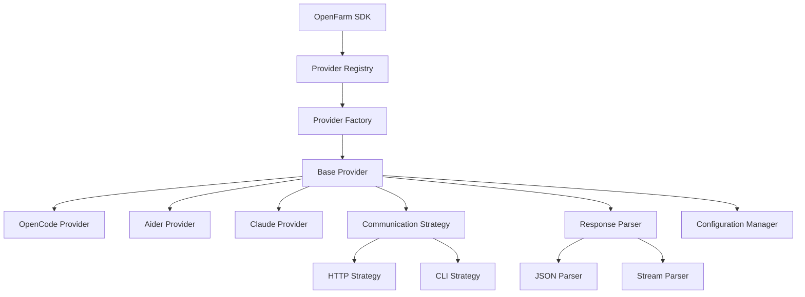

# Design Document: Provider Architecture Refactor

## Overview

This design refactors OpenFarm's monolithic provider architecture into a modular, plugin-based system. The current architecture suffers from 500+ line executor classes with duplicated logic for HTTP/CLI communication, response parsing, and configuration management.

The new architecture follows the **Microkernel Pattern** (also known as Plugin Architecture) where a minimal core system manages provider plugins. Each provider becomes a focused, single-responsibility module that can be developed, tested, and maintained independently.

**Key Design Principles:**
- **Lean Core**: Keep `@openfarm/sdk` minimal, move complex providers to separate packages
- **Single Responsibility**: Each provider handles only its specific communication protocol
- **Reusable Components**: Abstract common patterns (HTTP, CLI, parsing) into shared utilities
- **Backward Compatibility**: Maintain existing public API without breaking changes

## Architecture

### High-Level Architecture



### Package Structure

Following OpenFarm's **"Don't Bloat Core"** principle:

```
packages/
├── sdk/                           # Core SDK (LEAN)
│   ├── src/
│   │   ├── provider-system/       # New provider system
│   │   │   ├── registry.ts        # Provider discovery & registration
│   │   │   ├── factory.ts         # Provider instantiation
│   │   │   ├── base-provider.ts   # Abstract base class
│   │   │   └── types.ts           # Core interfaces
│   │   ├── strategies/            # Reusable communication patterns
│   │   │   ├── http-strategy.ts   # HTTP communication
│   │   │   ├── cli-strategy.ts    # CLI communication
│   │   │   └── types.ts           # Strategy interfaces
│   │   ├── parsers/               # Reusable response parsing
│   │   │   ├── json-parser.ts     # JSON response parsing
│   │   │   ├── stream-parser.ts   # Streaming response parsing
│   │   │   └── types.ts           # Parser interfaces
│   │   └── open-farm.ts           # Main SDK class (unchanged API)
│   
├── provider-opencode/             # NEW: Complex provider as separate package
│   ├── src/
│   │   ├── opencode-provider.ts   # OpenCode-specific logic
│   │   ├── opencode-config.ts     # OpenCode configuration
│   │   └── types.ts               # OpenCode-specific types
│   └── package.json               # @openfarm/provider-opencode
│   
├── provider-aider/                # NEW: Aider provider package
│   └── src/opencode-provider.ts   # Aider-specific logic
│   
└── provider-claude/               # NEW: Claude provider package
    └── src/claude-provider.ts     # Claude-specific logic
```

**Package Decision Rationale:**
- **Simple providers** (Direct API): Stay in core SDK
- **Complex providers** (OpenCode, Aider): Move to separate packages
- **Reusable utilities**: Stay in core SDK for sharing

## Components and Interfaces

### Core Interfaces

```typescript
// Core provider interface - all providers must implement this
interface Provider {
  readonly type: string;
  readonly name: string;
  execute(options: ExecutionOptions): Promise<ExecutionResult>;
  testConnection(): Promise<boolean>;
  validateConfig(config: unknown): boolean;
}

// Provider metadata for registry
interface ProviderMetadata {
  type: string;
  name: string;
  description: string;
  packageName?: string;
  version: string;
  supportedFeatures: string[];
}

// Communication strategy abstraction
interface CommunicationStrategy {
  execute(request: CommunicationRequest): Promise<CommunicationResponse>;
  testConnection(): Promise<boolean>;
}

// Response parser abstraction  
interface ResponseParser<T = unknown> {
  parse(response: CommunicationResponse): Promise<T>;
  canHandle(response: CommunicationResponse): boolean;
}
```

### Provider Registry

The registry manages provider discovery and instantiation:

```typescript
class ProviderRegistry {
  private providers = new Map<string, ProviderMetadata>();
  private factories = new Map<string, ProviderFactory>();

  // Auto-discovery of built-in providers
  async discoverProviders(): Promise<void> {
    // Scan for providers in core SDK
    // Scan for external provider packages
  }

  // Manual registration for external providers
  registerProvider(metadata: ProviderMetadata, factory: ProviderFactory): void {
    this.providers.set(metadata.type, metadata);
    this.factories.set(metadata.type, factory);
  }

  // Get provider instance
  createProvider(type: string, config?: unknown): Provider {
    const factory = this.factories.get(type);
    if (!factory) throw new Error(`Provider ${type} not found`);
    return factory.create(config);
  }

  // List available providers
  getAvailableProviders(): ProviderMetadata[] {
    return Array.from(this.providers.values());
  }
}
```

### Base Provider

Abstract base class providing common functionality:

```typescript
abstract class BaseProvider implements Provider {
  abstract readonly type: string;
  abstract readonly name: string;

  protected communicationStrategy: CommunicationStrategy;
  protected responseParser: ResponseParser;
  protected configManager: ConfigurationManager;

  constructor(
    strategy: CommunicationStrategy,
    parser: ResponseParser,
    config: ConfigurationManager
  ) {
    this.communicationStrategy = strategy;
    this.responseParser = parser;
    this.configManager = config;
  }

  // Template method - common execution flow
  async execute(options: ExecutionOptions): Promise<ExecutionResult> {
    const startTime = Date.now();
    
    try {
      // Validate configuration
      this.validateConfig(options);
      
      // Prepare request using strategy
      const request = await this.prepareRequest(options);
      
      // Execute via communication strategy
      const response = await this.communicationStrategy.execute(request);
      
      // Parse response
      const result = await this.responseParser.parse(response);
      
      // Format final result
      return this.formatResult(result, Date.now() - startTime);
      
    } catch (error) {
      return this.handleError(error, Date.now() - startTime);
    }
  }

  // Abstract methods for provider-specific logic
  protected abstract prepareRequest(options: ExecutionOptions): Promise<CommunicationRequest>;
  protected abstract formatResult(result: unknown, duration: number): ExecutionResult;
  
  // Default implementations
  async testConnection(): Promise<boolean> {
    return this.communicationStrategy.testConnection();
  }

  validateConfig(config: unknown): boolean {
    return this.configManager.validate(config);
  }

  protected handleError(error: unknown, duration: number): ExecutionResult {
    const message = error instanceof Error ? error.message : 'Unknown error';
    return {
      success: false,
      output: `Execution failed: ${message}`,
      duration,
      error: message
    };
  }
}
```

### Communication Strategies

Reusable communication patterns:

```typescript
// HTTP Strategy for REST APIs
class HttpCommunicationStrategy implements CommunicationStrategy {
  constructor(private baseUrl: string, private headers: Record<string, string> = {}) {}

  async execute(request: CommunicationRequest): Promise<CommunicationResponse> {
    const response = await fetch(`${this.baseUrl}${request.endpoint}`, {
      method: request.method || 'POST',
      headers: { ...this.headers, ...request.headers },
      body: request.body ? JSON.stringify(request.body) : undefined
    });

    return {
      status: response.status,
      headers: Object.fromEntries(response.headers.entries()),
      body: await response.text(),
      success: response.ok
    };
  }

  async testConnection(): Promise<boolean> {
    try {
      const response = await fetch(`${this.baseUrl}/health`);
      return response.ok;
    } catch {
      return false;
    }
  }
}

// CLI Strategy for command-line tools
class CliCommunicationStrategy implements CommunicationStrategy {
  constructor(private command: string, private defaultArgs: string[] = []) {}

  async execute(request: CommunicationRequest): Promise<CommunicationResponse> {
    return new Promise((resolve) => {
      const args = [...this.defaultArgs, ...(request.args || [])];
      const child = spawn(this.command, args, {
        cwd: request.workingDirectory,
        stdio: ['pipe', 'pipe', 'pipe']
      });

      let stdout = '';
      let stderr = '';

      child.stdout.on('data', (data) => stdout += data.toString());
      child.stderr.on('data', (data) => stderr += data.toString());

      child.on('close', (code) => {
        resolve({
          status: code || 0,
          body: stdout,
          error: stderr,
          success: code === 0
        });
      });
    });
  }

  async testConnection(): Promise<boolean> {
    try {
      const result = await this.execute({ args: ['--version'] });
      return result.success;
    } catch {
      return false;
    }
  }
}
```

### Response Parsers

Reusable parsing logic:

```typescript
// JSON Response Parser
class JsonResponseParser implements ResponseParser<any> {
  async parse(response: CommunicationResponse): Promise<any> {
    if (!this.canHandle(response)) {
      throw new Error('Response is not valid JSON');
    }
    return JSON.parse(response.body);
  }

  canHandle(response: CommunicationResponse): boolean {
    try {
      JSON.parse(response.body);
      return true;
    } catch {
      return false;
    }
  }
}

// Streaming Response Parser (for CLI tools with JSON events)
class StreamResponseParser implements ResponseParser<any[]> {
  async parse(response: CommunicationResponse): Promise<any[]> {
    const lines = response.body.split('\n').filter(line => line.trim());
    const events: any[] = [];

    for (const line of lines) {
      try {
        events.push(JSON.parse(line));
      } catch {
        // Skip non-JSON lines
      }
    }

    return events;
  }

  canHandle(response: CommunicationResponse): boolean {
    return response.body.includes('\n') && response.body.includes('{');
  }
}
```

## Data Models

### Configuration Management

```typescript
interface ProviderConfig {
  type: string;
  timeout?: number;
  retries?: number;
  [key: string]: unknown;
}

interface OpenCodeConfig extends ProviderConfig {
  type: 'opencode';
  mode: 'local' | 'cloud';
  baseUrl?: string;
  password?: string;
}

interface AiderConfig extends ProviderConfig {
  type: 'aider';
  executable?: string;
  additionalArgs?: string[];
}

class ConfigurationManager {
  private schema: Record<string, any>;

  constructor(schema: Record<string, any>) {
    this.schema = schema;
  }

  validate(config: unknown): boolean {
    // JSON Schema validation logic
    return true; // Simplified
  }

  getDefaults(): ProviderConfig {
    return {
      type: '',
      timeout: 600_000,
      retries: 3
    };
  }
}
```

### Request/Response Models

```typescript
interface CommunicationRequest {
  endpoint?: string;
  method?: string;
  headers?: Record<string, string>;
  body?: unknown;
  args?: string[];
  workingDirectory?: string;
}

interface CommunicationResponse {
  status: number;
  headers?: Record<string, string>;
  body: string;
  error?: string;
  success: boolean;
}
```

## Correctness Properties

*A property is a characteristic or behavior that should hold true across all valid executions of a system—essentially, a formal statement about what the system should do. Properties serve as the bridge between human-readable specifications and machine-verifiable correctness guarantees.*

### Property 1: Provider Registration Independence
*For any* new provider implementation, registering it in the Provider_Registry should not require modifications to existing provider code, and all existing providers should continue to function unchanged.
**Validates: Requirements 1.1, 1.5**

### Property 2: Automatic Provider Discovery
*For any* valid provider placed in the expected location, the Provider_Registry should discover it automatically during system initialization without manual registration.
**Validates: Requirements 1.2, 9.1, 9.2, 9.3**

### Property 3: Base Provider Inheritance
*For any* provider implementation, it should inherit all common functionality from Base_Provider and only implement provider-specific logic.
**Validates: Requirements 1.3, 1.4**

### Property 4: Strategy and Parser Reuse
*For any* two providers that use the same communication method (HTTP/CLI) or response format (JSON/Stream), they should reuse the same strategy and parser implementations.
**Validates: Requirements 2.2, 2.3, 3.2, 3.3**

### Property 5: Component Delegation
*For any* provider operation, the Base_Provider should correctly delegate communication to the appropriate strategy and parsing to the appropriate parser.
**Validates: Requirements 2.5, 3.5, 4.3**

### Property 6: Configuration Validation
*For any* provider configuration, the Configuration_Manager should validate it against the schema and return descriptive error messages for invalid configurations.
**Validates: Requirements 4.2, 4.5**

### Property 7: Backward Compatibility
*For any* existing OpenFarm SDK method call (execute, testConnection, setProvider), the refactored system should maintain the same public interface and behavior.
**Validates: Requirements 5.1, 5.2, 5.3, 5.4, 5.5**

### Property 8: Provider Test Isolation
*For any* provider, it should be testable in isolation without dependencies on other providers or external services.
**Validates: Requirements 6.1, 6.5**

### Property 9: Mock Support
*For any* communication strategy or response parser, it should be mockable for testing purposes.
**Validates: Requirements 6.2, 6.3, 6.4**

### Property 10: Package Organization
*For any* provider implementation, complex providers should exist in separate packages while simple providers may remain in core, following single-responsibility principle.
**Validates: Requirements 7.1, 7.2, 7.4, 7.5**

### Property 11: External Package Loading
*For any* provider implemented in an external package, the Provider_Registry should be able to load and use it seamlessly.
**Validates: Requirements 7.3**

### Property 12: Error Handling Consistency
*For any* error that occurs in the provider system, it should be handled consistently and returned in a standardized format across all providers.
**Validates: Requirements 8.1, 8.2, 8.3, 8.4, 8.5**

### Property 13: Provider Validation
*For any* provider implementation, the Provider_Registry should validate it meets the required interface before allowing registration.
**Validates: Requirements 9.5**

### Property 14: Performance Optimization
*For any* provider operations, the system should optimize resource usage through efficient instance creation, lazy loading, connection reuse, and metadata caching.
**Validates: Requirements 10.1, 10.2, 10.3, 10.4, 10.5**

## Error Handling

The new architecture standardizes error handling across all providers:

### Error Types
- **Configuration Errors**: Invalid provider configuration
- **Communication Errors**: Network, HTTP, or CLI execution failures  
- **Parsing Errors**: Response parsing failures
- **Provider Errors**: Provider-specific execution errors
- **Registry Errors**: Provider registration or discovery failures

### Error Format
All errors follow a consistent structure:
```typescript
interface ProviderError {
  type: 'configuration' | 'communication' | 'parsing' | 'provider' | 'registry';
  message: string;
  code: string;
  details?: Record<string, unknown>;
  cause?: Error;
}
```

### Error Handling Strategy
1. **Fail Fast**: Validate configuration and dependencies early
2. **Graceful Degradation**: Continue with available providers if some fail
3. **Detailed Logging**: Provide comprehensive error information for debugging
4. **User-Friendly Messages**: Return actionable error messages to users

## Testing Strategy

The modular architecture enables comprehensive testing at multiple levels:

### Unit Testing
- **Provider Components**: Test each provider in isolation
- **Communication Strategies**: Test HTTP/CLI strategies independently  
- **Response Parsers**: Test JSON/Stream parsers independently
- **Configuration Managers**: Test validation logic
- **Registry Operations**: Test provider registration and discovery

### Property-Based Testing
Each correctness property will be implemented as a property-based test with minimum 100 iterations:

- **Property 1**: Generate random providers, test registration independence
- **Property 2**: Place providers in various locations, test auto-discovery
- **Property 3**: Generate provider implementations, verify inheritance
- **Property 4**: Create multiple providers with same communication/parsing needs, verify reuse
- **Property 5**: Generate random operations, verify correct delegation
- **Property 6**: Generate valid/invalid configurations, test validation
- **Property 7**: Test all existing SDK methods maintain same behavior
- **Property 8**: Test provider isolation with various dependency scenarios
- **Property 9**: Test mocking capabilities across all components
- **Property 10**: Verify package organization follows single-responsibility
- **Property 11**: Test external package loading with various package structures
- **Property 12**: Generate various error scenarios, verify consistent handling
- **Property 13**: Generate valid/invalid provider implementations, test validation
- **Property 14**: Test performance characteristics under various load scenarios

### Integration Testing
- **End-to-End Provider Execution**: Test complete provider workflows
- **Multi-Provider Scenarios**: Test switching between providers
- **External Package Integration**: Test loading providers from external packages
- **Backward Compatibility**: Test existing code against new architecture

### Test Configuration
- **Property Tests**: Minimum 100 iterations per property
- **Test Tags**: **Feature: provider-architecture-refactor, Property {number}: {property_text}**
- **Mock Strategy**: Mock at boundaries (HTTP, CLI, file system), not domain logic
- **Coverage Target**: 90% for core provider system, 80% for individual providers